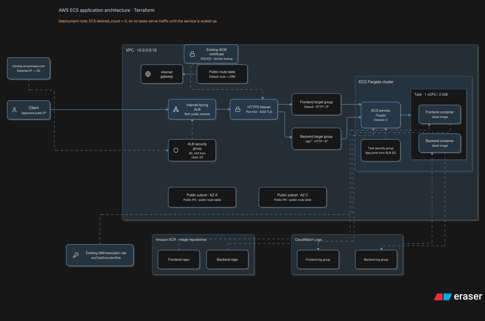

# AWS ECS Fargate Infrastructure with Terraform (IaC)

This repository contains Terraform (Infrastructure as Code) configurations for building a web application runtime environment centered around AWS ECS Fargate.

- Modular Design: By organizing components into modules (modules/), the code structure is highly reusable and maintainable.

- Purpose: This is my standard environment setup code used for learning and experimentation. It provisions an architecture designed to host frontend and backend APIs.

- Cost Optimization: To minimize costs, NAT Gateways are intentionally omitted. Instead, the architecture relies on IP address restrictions for access control.

---

## Architecture



### Key Components
- VPC / Subnets: High availability with a Multi-AZ architecture (2 Public Subnets).

- ALB (Application Load Balancer): Load balancing for incoming HTTP/HTTPS traffic from the internet.

- ECS (Fargate): Serverless container execution environment.

- ECR (Elastic Container Registry): Storage for container images.

- CloudWatch Logs: Centralized logging for containers and the ALB.

---

## Directory Structure

```text
.
├── assets
│   └── architectureDiagram.svg
├── main.tf
├── modules
│   ├── acm
│   ├── alb
│   ├── ecr
│   ├── ecs
│   ├── iam
│   ├── logs
│   ├── routes
│   ├── securityGroup
│   ├── subnet
│   └── vpc
├── README.md
├── terraform.tfvars.example
├── backend.tfbackend.example
└── variables.tf
```


## Prerequisites

Create S3 Bucket for Backend State Management
Before initializing Terraform, you must create an S3 bucket to store the `terraform.tfstate` file remotely and enable state locking.

#### 1. Create S3 Bucket
Create an S3 bucket (e.g., `your-tfstate-bucket-name`) in AWS Console or AWS CLI.

#### 2. Enable Security & Versioning:
Enable Bucket Versioning, Server-Side Encryption (AES256), and Block All Public Access for security.

#### 3. State Locking (S3 Native):
This repository utilizes native S3 state locking (`use_lockfile = true`) provided in Terraform v1.10+, eliminating the need for a separate DynamoDB table.

## Usage

### 1. Clone the repository
```
git clone https://github.com/JunyaUkyou/my-ecs.git
cd my-ecs

```

### 2. Prepare configuration files

Copy `backend.tfbackend.example` to create `backend.tfbackend`, and update it with your S3 backend configurations.

```
cp backend.tfbackend.example backend.tfbackend
```


Copy `terraform.tfvars.example` to create `terraform.tfvars`, and modify the settings as needed.

Copy terraform.tfvars.example to create terraform.tfvars, and modify the values according to your environment requirements.

```
cp terraform.tfvars.example terraform.tfvars
```

### 3. Initialize and review the execution plan

Initialize Terraform by specifying your backend configuration file.

```
terraform init -backend-config=backend.tfbackend

terraform validate

terraform plan

```

### 4. Deploy resources
```
terraform apply
```

### 5. Push a container image to ECR

Build your frontend and backend Docker images, and push them to the newly provisioned ECR repositories.

### 6. Update the ECS task count

The default desired task count is set to 0. Once your images are pushed to ECR, you need to update the task count to start your containers.


## Scope of this Repository
This Terraform configuration manages the ECS cluster, services, tasks, and ECR repositories for the frontend and backend.

### Out of Scope (Not Included)
* DNS record configurations (Route 53, etc.)
* Database resources (e.g., Amazon RDS / External DB)